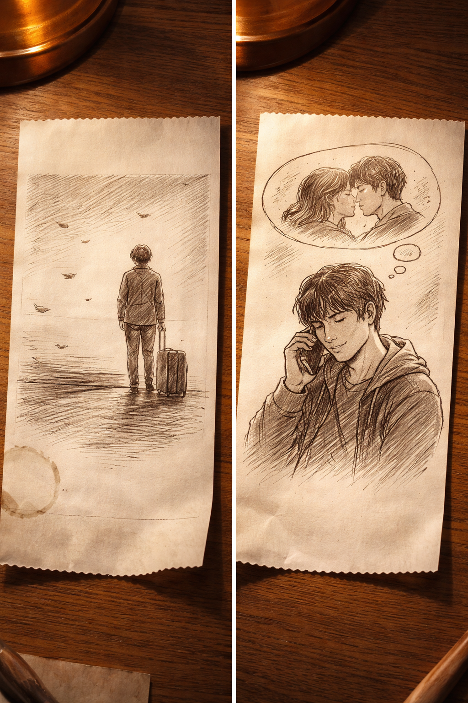
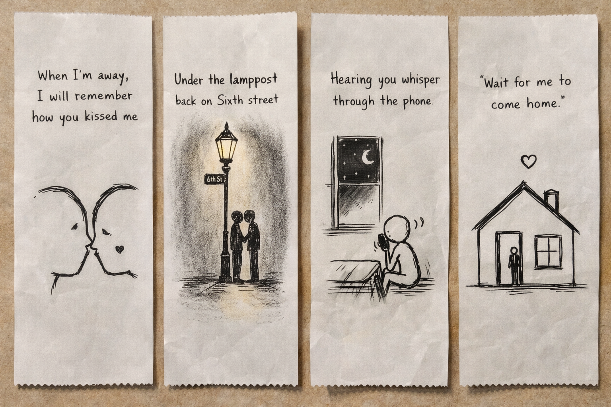

# Peach & Paper

An AI-powered visual storytelling experience inspired by nostalgia, handwritten memories, and cinematic design.

Peach & Paper transforms emotions, lyrics, and personal moments into aesthetic receipt-style visual experiences. The project blends Generative AI with immersive frontend design to create a soft, emotional, and interactive storytelling platform.

Designed around warmth, memory, and minimalism, the experience focuses on creating visuals that feel personal, nostalgic, and human.

---

## Live Experience

[Visit Peach & Paper](https://peach-and-paper.vercel.app/)

---

## Preview

### Result Experience



### Homepage



Example structure:

```bash
project/
|
+-- images/
|   +-- result.png
|   +-- homepage_new.png
```

---

## Features

- AI-powered visual storytelling
- Cinematic scroll-based interactions
- Receipt-inspired aesthetic design
- Emotional and nostalgic visual direction
- Smooth animations with Framer Motion
- Responsive modern interface
- Minimal and immersive UI experience
- Dynamic storytelling workflow
- Soft pastel-inspired design system

---

## Inspiration

Peach & Paper was inspired by:

- handwritten memories
- old receipts and paper textures
- emotional song lyrics
- nostalgic photography
- cinematic lighting
- warm desk aesthetics
- minimalist sketch storytelling

The goal was to create an experience that feels calm, emotional, and visually personal rather than purely functional.

---

## Why I Built This

I wanted to explore how AI and frontend design could work together to create emotional digital experiences instead of traditional utility-focused applications.

Most AI projects focus heavily on productivity and automation, while Peach & Paper focuses on atmosphere, storytelling, and emotional interaction.

The project also helped me experiment with:

- AI-assisted creative workflows
- immersive frontend animation
- visual storytelling systems
- aesthetic UI design
- scroll-driven interactions
- responsive user experiences

---

## Tech Stack

- Vite
- React
- TypeScript
- Tailwind CSS
- shadcn/ui
- Framer Motion
- Generative AI APIs
- Vercel

---

## How It Works

```text
User Input
   |
Narrative Processing
   |
Scene Generation
   |
AI Visual Creation
   |
Interactive Story Experience
```

---

## Getting Started

Clone the repository:

```bash
git clone https://github.com/zaid1234-11/peach-and-paper.git
```

Move into the project directory:

```bash
cd peach-and-paper
```

Install dependencies:

```bash
npm install
```

Start the development server:

```bash
npm run dev
```

Open the local URL shown in your terminal. Vite commonly starts at:

```bash
http://localhost:5173
```

---

## Available Scripts

```bash
npm run dev          # Start development server
npm run build        # Create a production build
npm run build:dev    # Create a development-mode build
npm run preview      # Preview the production build
npm run lint         # Run ESLint
npm test             # Run tests once
npm run test:watch   # Run tests in watch mode
```

---

## Design Direction

The visual identity of Peach & Paper is built around:

- soft peach pastel tones
- warm cinematic lighting
- thermal receipt textures
- handwritten-inspired aesthetics
- layered storytelling visuals
- minimalist emotional design

---

## Future Improvements

- AI-generated receipt sketches
- Personalized memory timelines
- Music-reactive storytelling
- Multi-scene visual generation
- Exportable visual journals
- AI-assisted narrative creation
- Dynamic ambient animations

---

## Deployment

This project is deployed on:

- Vercel

---

## License

This project is licensed under the MIT License.
